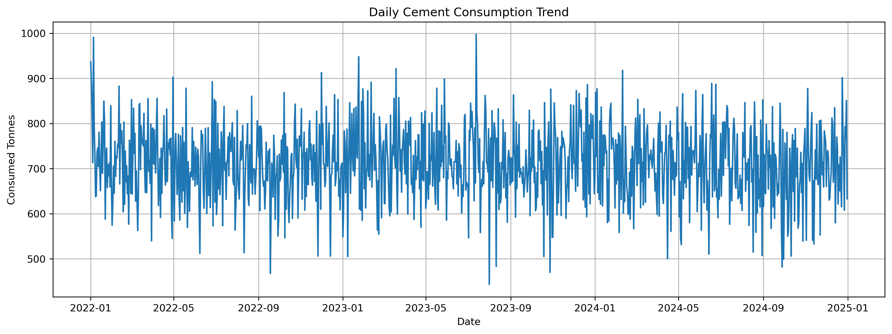
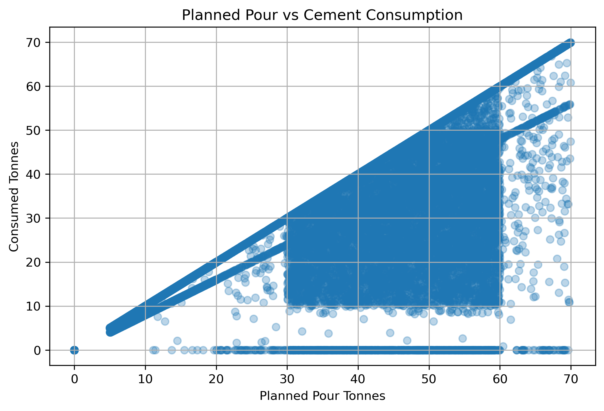
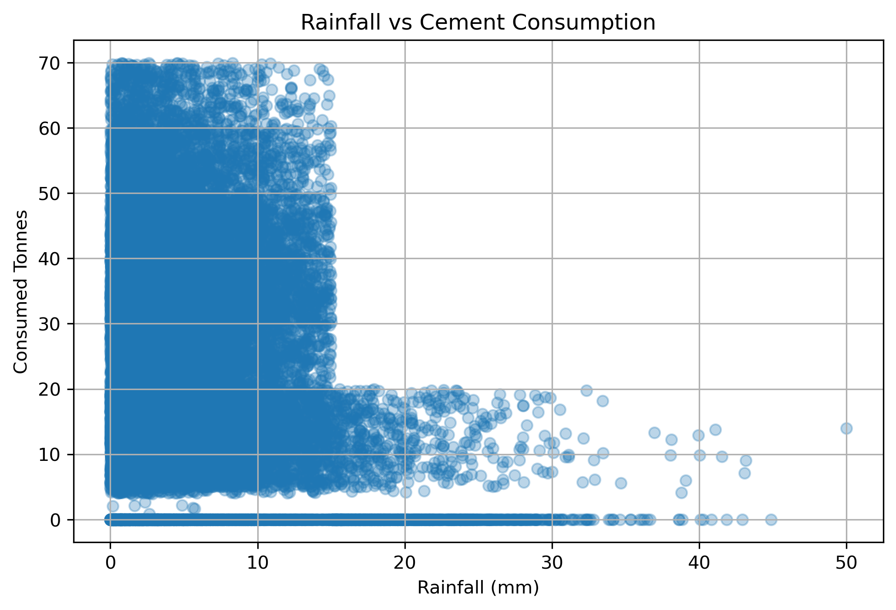
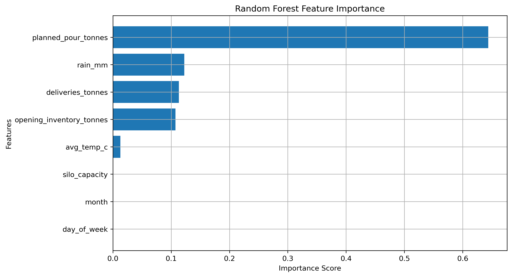
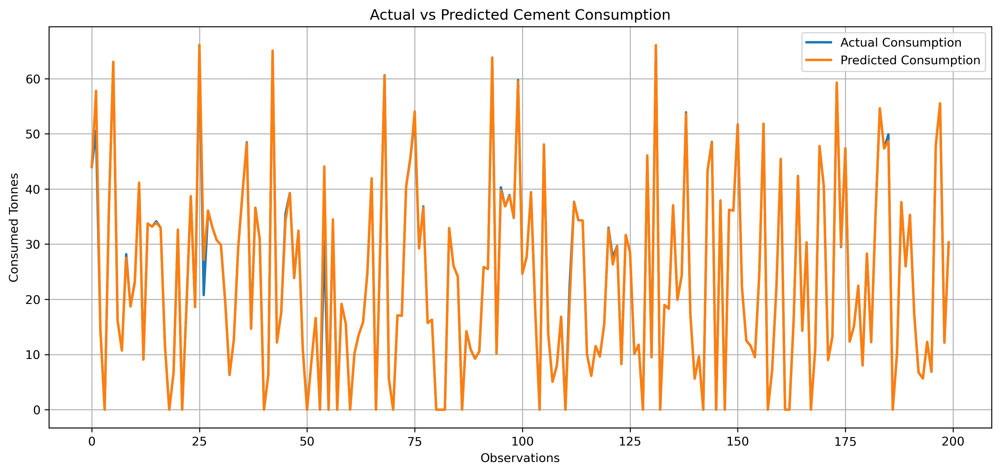

# Cement Demand Forecasting Across Multiple Sites

## Project Overview
This project develops a predictive cement demand forecasting solution for Midlands Infrastructure Group (MIG), a multi-site construction company. The goal is to forecast cement consumption, improve inventory planning, reduce stockout risk, and support proactive operational decision-making.

## Business Problem
Cement demand is affected by planned pours, site activity, deliveries, inventory levels, and weather conditions. Manual forecasting can lead to stockouts, overstocking, urgent deliveries, project delays, and material waste.

## Objectives
- Forecast cement demand across construction sites
- Analyze key drivers of cement consumption
- Compare machine learning and time-series models
- Support inventory optimization and reorder planning

## Dataset
The dataset contains 32,880 records across 30 construction sites and 3 cement types.

Key features include:
- Date
- Site ID
- Cement Type
- Planned Pour Tonnes
- Consumed Tonnes
- Opening Inventory
- Deliveries
- Closing Inventory
- Rainfall
- Temperature
- Silo Capacity

## Methodology
1. Data loading from SQLite
2. Data quality validation
3. Exploratory Data Analysis
4. Feature engineering
5. Random Forest forecasting
6. SARIMAX forecasting
7. Model comparison
8. Business recommendations

## Model Results

| Model | MAE | RMSE | R² Score |
|---|---:|---:|---:|
| Random Forest | 0.16 | 0.71 | 0.998 |
| SARIMAX | 7.28 | 9.94 | 0.65 |

## Visual Outputs

The notebook includes key visualizations to support business interpretation, including:

- Daily cement consumption trend
- Monthly cement consumption trend
- Planned pours vs actual consumption
- Rainfall impact on cement consumption
- Top 10 cement consuming sites
- Feature importance analysis
- Actual vs predicted forecast comparison

## Dashboard Development

A future enhancement of this project is to develop an interactive forecasting dashboard using Plotly Dash or Streamlit.

The dashboard can include:

- Site-level cement demand forecasts
- 8-week forecast view
- Reorder alerts
- Inventory level monitoring
- Silo utilization metrics
- Weather impact indicators
- Model performance summary

This dashboard would allow project managers, site teams, and supply chain stakeholders to monitor cement demand and inventory risks in real time.

## Key Findings
- Planned pour tonnage was the strongest predictor of cement demand.
- Rainfall, deliveries, and opening inventory also influenced demand.
- Random Forest significantly outperformed SARIMAX.
- Machine learning is more effective for capturing complex operational patterns in this dataset.

## Conclusion
The Random Forest model provides highly accurate cement demand forecasts and can support better inventory planning, delivery coordination, silo utilization, and operational decision-making across multiple construction sites.

## Technologies Used
- Python
- Pandas
- NumPy
- Matplotlib
- Scikit-learn
- Statsmodels
- Jupyter Notebook
- SQLite

## Key Visualizations

### Daily Cement Consumption Trend

The daily cement consumption trend visualization highlights fluctuations in operational demand across the observed time period. The chart reveals recurring increases and declines in cement usage, indicating variations in construction activities, project schedules, and operational intensity across multiple construction sites.

---

### Monthly Cement Consumption Trend

The monthly cement consumption visualization provides a broader view of operational demand patterns over time. The chart indicates noticeable monthly variations in cement usage, suggesting the presence of changing construction activities and temporal demand behaviour.

---

### Planned Pour vs Actual Cement Consumption

The planned versus actual cement consumption chart demonstrates a positive relationship between planned pour volumes and actual cement demand. This confirms that planned construction activities are a major driver of cement consumption forecasting across sites.

---

### Rainfall vs Cement Consumption

The rainfall impact visualization illustrates the relationship between weather conditions and cement demand. The analysis suggests that higher rainfall levels may contribute to reduced construction activity and lower cement consumption volumes.

---

### Top Cement Consuming Sites

The top cement consuming sites chart identifies the construction sites with the highest cumulative cement demand. These sites represent major operational locations that may require enhanced inventory planning and forecasting attention.

---

### Feature Importance Analysis

The feature importance visualization identifies the most influential variables affecting cement demand forecasting. Planned pours, rainfall, deliveries, and opening inventory were found to be the strongest predictors of cement consumption.

---

### Actual vs Predicted Forecast Comparison

The actual versus predicted forecast chart demonstrates the strong predictive performance of the Random Forest model. The close alignment between actual and forecasted values confirms the model’s ability to accurately capture operational cement demand patterns.

