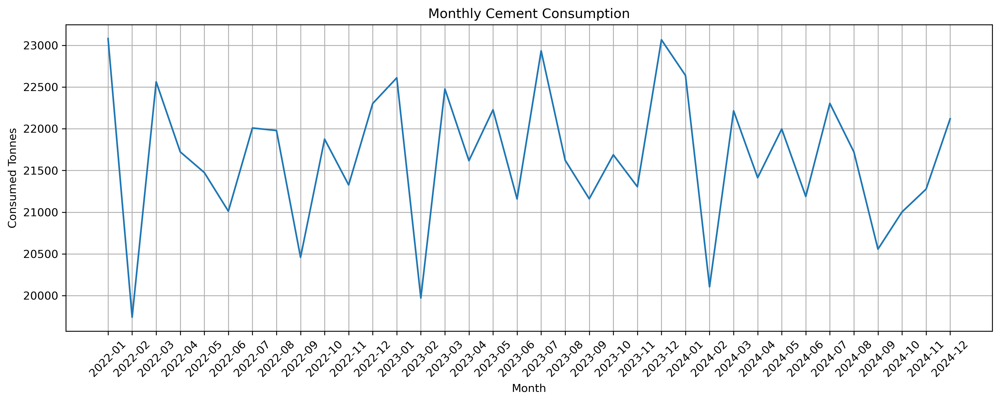
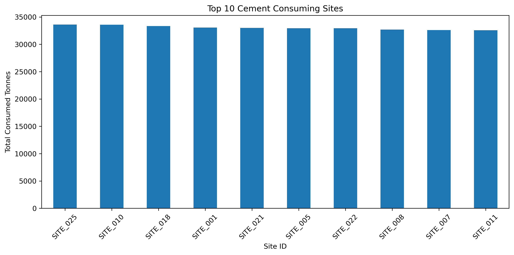

# Cement Demand Forecasting Across Multiple Sites

## Project Overview
This project develops a predictive cement demand forecasting solution for Midlands Infrastructure Group (MIG), a multi-site construction company. The goal is to forecast cement consumption, improve inventory planning, reduce stockout risk, and support proactive operational decision-making.

## Business Problem
Cement demand is affected by planned pours, site activity, deliveries, inventory levels, and weather conditions. Manual forecasting can lead to stockouts, overstocking, urgent deliveries, project delays, and material waste.

## Objectives
- Forecast cement demand across construction sites
- Analyze key drivers of cement consumption
- Compare machine learning and time-series models
- Support inventory optimization and reorder planning

## Dataset
The dataset contains 32,880 records across 30 construction sites and 3 cement types.

Key features include:
- Date
- Site ID
- Cement Type
- Planned Pour Tonnes
- Consumed Tonnes
- Opening Inventory
- Deliveries
- Closing Inventory
- Rainfall
- Temperature
- Silo Capacity

## Methodology
1. Data loading from SQLite
2. Data quality validation
3. Exploratory Data Analysis
4. Feature engineering
5. Random Forest forecasting
6. SARIMAX forecasting
7. Model comparison
8. Business recommendations

## Model Results

| Model | MAE | RMSE | R² Score |
|---|---:|---:|---:|
| Random Forest | 0.16 | 0.71 | 0.998 |
| SARIMAX | 7.28 | 9.94 | 0.65 |

## Visual Outputs

The notebook includes key visualizations to support business interpretation, including:

- Daily cement consumption trend
- Monthly cement consumption trend
- Planned pours vs actual consumption
- Rainfall impact on cement consumption
- Top 10 cement consuming sites
- Feature importance analysis
- Actual vs predicted forecast comparison

## Dashboard Development

A future enhancement of this project is to develop an interactive forecasting dashboard using Plotly Dash or Streamlit.

The dashboard can include:

- Site-level cement demand forecasts
- 8-week forecast view
- Reorder alerts
- Inventory level monitoring
- Silo utilization metrics
- Weather impact indicators
- Model performance summary

This dashboard would allow project managers, site teams, and supply chain stakeholders to monitor cement demand and inventory risks in real time.

## Key Findings
- Planned pour tonnage was the strongest predictor of cement demand.
- Rainfall, deliveries, and opening inventory also influenced demand.
- Random Forest significantly outperformed SARIMAX.
- Machine learning is more effective for capturing complex operational patterns in this dataset.

## Conclusion
The Random Forest model provides highly accurate cement demand forecasts and can support better inventory planning, delivery coordination, silo utilization, and operational decision-making across multiple construction sites.

# Key Visualizations

## Daily Cement Consumption Trend

The daily cement consumption trend highlights operational demand fluctuations across construction sites over time.

---

## Monthly Cement Consumption Trend

The monthly consumption analysis shows broader temporal variations in cement demand patterns.

---

## Planned Pour vs Actual Cement Consumption

This visualization demonstrates the relationship between planned construction activities and actual cement usage.

---

## Rainfall vs Cement Consumption

The rainfall analysis illustrates the potential impact of weather conditions on construction activity and cement demand.

---

## Top Cement Consuming Sites

This chart identifies the construction sites with the highest cumulative cement consumption.

---

## Feature Importance Analysis

The Random Forest feature importance analysis identifies the most influential variables affecting cement demand forecasting.

---

## Actual vs Predicted Forecast Comparison

The forecasting visualization compares actual cement consumption with predicted values generated by the Random Forest model.

---

# Forecasting Deliverables

The following outputs were generated as part of the forecasting workflow:

- Forecast Results Export
- Feature Importance Export
- Model Comparison Export
- Inventory Simulation Export
- Forecast Visualization Outputs

All exported deliverables are available inside the `outputs/` directory.

---

# Technologies Used

- Python
- Pandas
- NumPy
- Matplotlib
- Scikit-learn
- Statsmodels
- Jupyter Notebook
- SQLite
- Git & GitHub

---

# Future Improvements

- Deploy an interactive Streamlit/Dash forecasting dashboard
- Integrate real-time construction operational data
- Explore advanced forecasting models such as XGBoost and LSTM
- Add automated inventory alert systems
- Deploy forecasting APIs for enterprise integration

